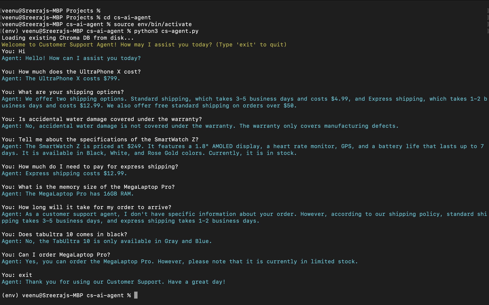

# Customer Support Agent with RAG

This project implements a customer support agent for an e-commerce platform using **Retrieval-Augmented Generation (RAG)**. It leverages a knowledge base stored in text files, vectorized with Chroma, and powered by OpenAI's embeddings and language models to provide accurate, context-aware responses.

## Input Files Structure
products.txt : 
    Contains details about 5 distinct products.
    Each product's information is separated by double newlines (\n\n).
    The double newlines serve as natural delimiters between product entries.
    For example:

    ```
    Product: UltraPhone X  
    Price: $799  
    Features: 6.5" OLED display, 128GB storage, 12MP camera  
    Colors: Black, Silver, Blue  
    Availability: In stock

    Product: MegaLaptop Pro  
    Price: $1,299  
    Features: 15.6" Retina display, Intel i7, 16GB RAM, 512GB SSD  
    Colors: Space Gray, Silver  
    Availability: Limited stock

policies.txt
    Lists multiple policies, with each policy's details separated by double newlines.   
    example:

    ```
    Shipping Policy:
    Standard shipping (3-5 business days): $4.99
    Express shipping (1-2 business days): $12.99
    Free standard shipping on orders over $50

    Return Policy:
    30-day return period with original packaging and receipt
    Refunds processed within 5-7 business days


## Approach

The agent uses a **RAG** architecture to combine retrieval and generation:
1. **Knowledge Base Loading**: Text files (`products.txt`, `policies.txt`) are loaded from the `knowledge_base` directory, split into chunks by blank lines, and converted into `Document` objects with metadata (category, source).
    - Loads the raw text from these files and splits it into chunks based on the double newline (\n\n) separator.
    - This strategy ensures each product or policy is treated as a standalone unit
    - In products.txt, the text is split into 5 separate chunks—one for each product.
    - In policies.txt, the text is split into chunks corresponding to each policy.
    - The double newline approach leverages the files inherent structure, where it signals the end of one entry and the start of the next.
    - Each resulting chunk (e.g., a single product's details or a single policy) is converted into a Document object, a core concept in LangChain.
    - These objects are enriched with metadata, such as:
        **category** : Indicates whether the chunk belongs to "products" or "policies."
        **source** : Specifies the originating file (e.g., products.txt or policies.txt).
        Example: The first product might become a Document with:

        ```
        Content: "Product: UltraPhone X \nPrice: $799  \nFeatures: 6.5" OLED display, 128GB storage, 12MP camera  \nColors: Black, Silver, Blue  \nAvailability: In stock"
        Metadata: {"category": "products", "source": "products.txt"}

    - Why This Approach?
         * Granularity: Splitting by double newlines ensures each Document contains exactly one product or policy, making retrieval precise. 
         For example, a query about "UltraPhone X" retrieves only that product's details.
         * Efficiency: Storing each entry as a separate Document allows the vector store to index and search them individually, improving similarity-based retrieval accuracy.

2. **Vector Store**: Documents are embedded using OpenAI's `text-embedding-ada-002` model and stored in a persistent Chroma vector database (`chroma_db_cs-ai-agent`). This enables efficient similarity-based retrieval.
    - LangChain integrates the embedding process by providing a seamless interface to OpenAI’s embedding model and Chroma. 
    - It uses a utility like Chroma.from_documents() to embed and store the Document objects in one step.
    - It also manages metadata, ensuring that when a vector is retrieved, the original text and source information come along with it.
3. **Retrieval**: The agent's retriever uses similarity search with a threshold (`0.7`) to fetch the top relevant data (`k=1`) for a user's query.
    - It calculates the cosine similarity (a measure of how close two vectors are, ranging from -1 to 1) between the query vector and each document vector.
    - A similarity threshold of 0.7 is applied. This means only documents with a cosine similarity score of 0.7 or higher (on a scale where 1 is identical) are considered relevant.
    - This prevents the agent from returning loosely related or irrelevant data
    - The parameter k=1 specifies that only the top 1 most similar document is retrieved
4. **Generation**: Retrieved context is fed into a `gpt-4` model via a custom `PromptTemplate`, ensuring polite, professional responses. If no relevant context is found, the agent admits it doesn’t know rather than hallucinating.
5. **Chain**: The `RetrievalQA` chain integrates retrieval and generation, returning both the answer and source documents for transparency.

This RAG setup ensures responses are grounded in the knowledge base, minimizing inaccuracies while leveraging the LLM's natural language capabilities.

## Models Used

The RAG implementation relies on the following models from OpenAI:
- **Embedding Model**: `text-embedding-ada-002`  
  - Used to generate vector embeddings for the knowledge base documents, enabling efficient similarity-based retrieval.
- **LLM Model**: `gpt-4`  
  - Powers the generation step, producing polite and professional responses based on retrieved context.

## Setup Instructions
Follow these steps to set up and run the Customer Support Agent:

1. **Prerequisites**:
   - Python 3.8 or higher
   - Required packages: `langchain`, `langchain_openai`, `langchain_chroma`, `chromadb`
   - An OpenAI API key (obtainable from [OpenAI](https://openai.com))
   - Replace OPENAI_API_KEY in the .env file with your own OpenAI API key.

2. **Installation**:
   - Install the required packages with their specific versions as listed in `requirements.txt`:
     ```bash
     pip install -r requirements.txt  # Install dependencies

3. **Start the agent**:

    ```bash
    python3 cs-agent.py

### **(Optional) Using a Virtual Environment**

    
    python3 -m venv env          # Create a virutal environment
    source env/bin/activate      # Activate it (use `env\Scripts\activate` on Windows)
    
## Example Conversations

### Example 1
**You:** How much does the UltraPhone X cost?
**Agent:** The UltraPhone X costs $799.

### Example 2
**You:** What are your shipping options?
**Agent:** We offer two shipping options. Standard shipping, which takes 3-5 business days and costs $4.99, and Express shipping, which takes 1-2 business days and costs $12.99. We also offer free standard shipping on orders over $50.

### Example 3
**You:** Is accidental water damage covered under the warranty?
**Agent:** No, accidental water damage is not covered under the warranty. The warranty only covers manufacturing defects.

### Example 4
**You:** Tell me about the specifications of the SmartWatch Z?
**Agent:** The SmartWatch Z is priced at $249. It features a 1.8" AMOLED display, a heart rate monitor, and GPS. It also boasts a 7-day battery life. The watch is available in Black, White, and Rose Gold colors. It is currently in stock.

### Example 5
**You:** How much do I need to pay for express shipping?
**Agent:** Express shipping costs $12.99.

### Example 6
**You:** What is the memory size of the MegaLaptop Pro?
**Agent:** The MegaLaptop Pro has 16GB RAM.

### Example 7
**You:** How long will it take for my order to arrive?
**Agent:** As a customer support agent, I don't have specific information about your order. However, according to our shipping policy, standard shipping takes 3-5 business days and express shipping takes 1-2 business days. The exact delivery time will depend on the shipping option you chose when you placed your order.

### Example 8
**You:** Does tabultra 10 comes in black?
**Agent:** No, the TabUltra 10 is only available in Gray and Blue.

### Example 9
**You:** Can I order MegaLaptop Pro?
**Agent:** Yes, you can order the MegaLaptop Pro. However, please note that it is currently in limited stock.

## Conversation Snapshot below:


---